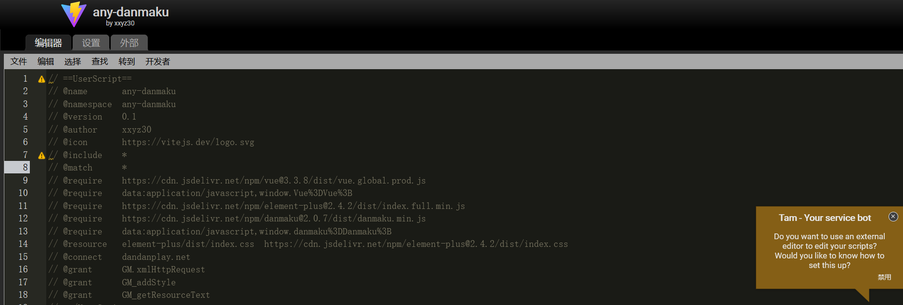
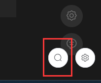
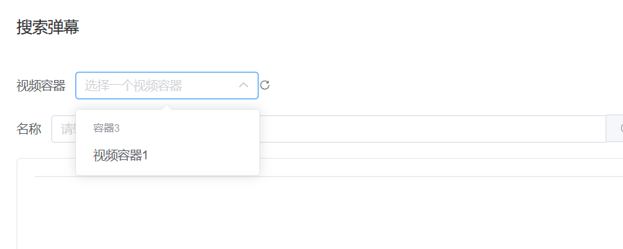
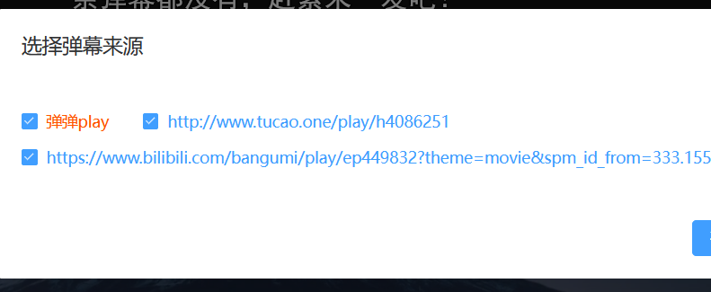
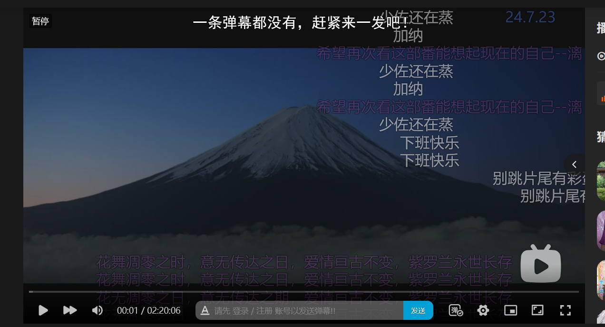

# 什么是Any Danmaku?
Any Danmaku 是一个可以让你在任何一个网页上的视频容器具有播放弹幕功能的一个油猴插件。
# 为什么要开发这个插件?
在网站看番剧的时候，经常因为番剧网站流量问题，没有人发弹幕，导致观看的时候总觉得少了些什么，看的不够尽兴。 
# 实现原理
通过劫持浏览器的`video`标签，在`video`标签上显示一层自己的遮罩，再在此遮罩上播放弹幕，即可实现此效果。 
弹幕来源为[弹弹play](https://www.dandanplay.com/)
弹幕播放实现为[Danmaku](https://github.com/weizhenye/Danmaku)
# 优点
- 您无需下载任何额外客户端，只需要安装一个插件即可
- 您无需下载任何视频到本地，只需要找个能播放番剧的网站即可
- 如果您喜欢看更加清晰的下载下来的番剧(例如使用NAS存储，且使用浏览器进行播放)，也可以使用这个插件来增加弹幕功能

# 使用方法
下载油猴插件，然后将`release`内已经编译好的脚本放进去(后续考虑增加油猴官网直链)

此脚本对于大多数网站应该都有效(除了启用了`CSP`的网站,虽然是个BUG，但番剧网站会带`CSP`吗？)

若是正确安装了,则右下角会出现搜索按钮

会弹出一个框，让你选择视频容器和输入番剧名称 
若是没有出现视频容器，则点击右边的刷新按钮重载视频容器

找到你想要的弹幕，选择一集，点击确定，会向`弹弹play`服务器请求弹幕

选择一个你想要加载来源的弹幕(后续会优化播放器,就不用在这里选了)

这样就会让视频播放器增加弹幕功能啦！ 
上面这条弹幕是网站本身的，其它半透明弹幕是`Any Danmaku`插件添加的

# 常见问题
- 状态码`403`
> 检测一下你的ip地址是否在`弹弹play`所允许的地方(不要用全局！)
- 出现两个搜索框,一个在视频内部,一个在外层
> 当前网页的`iframe`标签是跨域的,必须在内部显示,否则js无法操作内部网页。
- 有些番剧搜不到
> 番剧在`弹弹play`那可能不叫这个名字,得换关键词搜索。 
> 比如`《哭泣少女乐队》`,在弹弹play内显示的名字叫`GIRLS BAND CRY`,得搜这个名字。
- 繁体中文的弹幕
> 来自巴哈的弹幕,不喜欢的话可以不用选。若可行以后增加繁简转换。
- 不能自己发送弹幕
> Any Danmaku没有自己的服务器，无法安全地存储弹弹Play的Token,目前不考虑实现此功能。

# 已知问题
- 在启用了`SCP`的网站上无法正确加载JS
- 没有弹幕关键词过滤功能
- 弹幕数量计算算法设计不够好，当弹幕数量过多时会明显卡顿
- 当弹幕内容过长时，屏幕上弹幕会过多
- 无法关闭弹幕，只能重载界面